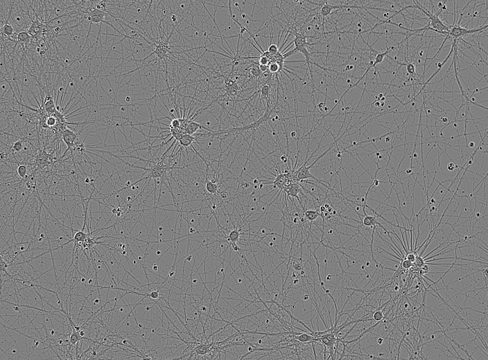

# Sartorius-Cell-Instance-Segmentation

Use Deep Learning models to segment cells in microscopy image.

The dataset is downloaded from: https://www.kaggle.com/competitions/sartorius-cell-instance-segmentation/data

**Sample image in this dataset**:



# Methods

**Models:** 
1. Mask RCNN
2. Cellpose
3. Training Size Model (Cellpose's assistant model)

**Data:** 
1. Mosaic
2. Add extra data for the `SH-SY5Y` cell line from LIVECell dataset which is the predecessor of this dataset
3. Data Augmentation (Flip left/right, Flip up/down, Crop, Add noise, Rotation

**Loss:**
1. L2 Regularization

# Repository structure

## 📂 Browser folder
`./browser/` folder stores all demo files which use Mask RCNN or/and Cellpose to detect cells in microscopy image on web.

Using command `streamlit run main.py` to start server.
```
.
├── browser
│   ├── cellpose_utils.py
│   ├── main.py
│   ├── mrcnn_utils.py
│   └── utils.py
```

## 📂 Models folder
Mask RCNN and Cellpose packages are stored in `./models/` folder.
```
.
├── models
│   ├── Mask_RCNN
│   ├── cellpose
```

## 📂 Requirement folder
`./requirement/cellpose-requirement.txt` contains all packages used by Cellpose and 
`./requirement/mrcnn-requirement.txt` contains all packages used by Mask RCNN.
```
.
├── requirement
│   ├── cellpose-requirement.txt
│   └── mrcnn-requirement.txt
```

## 📂 Technique folder

`./technique/` folder stores all files demo of those techniques used in this project

```
.
├── technique
│   ├── augmentation
│   ├── helper_package
│   ├── livecell prepare.ipynb
│   ├── mini mask.ipynb
│   └── mosaic
```

## 📂 Train-infer-model folder

All `.ipynb` files which used to train and test model are stored in `./train-infer-model/` folder.

```
.
├── train-infer-model
│   ├── cellpose
│   ├── data
│   ├── mask_rcnn
│   └── performance
```

# Demo

Using `streamlit` framework to demo on website

...

# Reference

Mask RCNN: https://github.com/leekunhee/Mask_RCNN

Cellpose: https://github.com/MouseLand/cellpose

Streamlit: https://streamlit.io/


